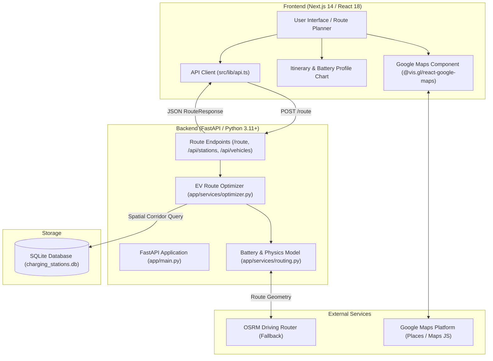

# VoltRoute - EV Route Planner

VoltRoute is an EV route-planning application that combines road routing with battery-aware charging-stop optimization. Users enter their origin, destination, vehicle, and starting battery level, and VoltRoute calculates a feasible trip with recommended charging stops.

Google Maps Platform handles the geographical visualization, place search, and navigation links, while VoltRoute's backend evaluates vehicle energy consumption, battery State of Charge (SOC), and highway corridor charging stations to determine optimal charging stops.

---

## Features

- **Google Maps Road Routing**: Interactive map visualization displaying route geometry, origin, destination, recommended charging stops, and corridor candidate stations.
- **Google Places Search & Autocomplete**: Search origins and destinations worldwide with place autocomplete and coordinate resolution.
- **EV-Aware Route Planning**: Simulates real-world EV energy consumption using usable battery capacity (kWh) and vehicle efficiency (Wh/km).
- **Battery / SOC-Aware Charging-Stop Selection**: Evaluates battery depletion along the route corridor and places charging stops before reaching safety buffer thresholds.
- **Charging Station Metadata**: Displays station operators (e.g., Tata Power, Zeon, Jio-bp, ChargeZone, Statiq, Relux), power ratings (kW), connector types (CCS2, Type 2, NACS), pricing, and amenities.
- **Non-Linear Charging Curve Simulation**: Models realistic battery charging taper behavior (faster charge below 50% SOC, gradual taper between 50%–80%, steep taper above 80%).
- **Accurate Charging Cost Estimation**: Calculates estimated charging costs per stop and for the entire trip based on station pricing (₹/kWh or $/kWh).
- **Multiple Trip Preferences**:
  - **Fastest**: Prioritizes high-power DC fast chargers to minimize total travel time.
  - **Cheapest**: Prioritizes lower per-kWh charging rates to minimize trip cost.
  - **Fewest Stops**: Maximizes driving leg distances between charging stops.
- **Custom EV Configuration**: Add any custom EV model by specifying battery capacity (kWh), vehicle efficiency (Wh/km), and max charge rate (kW).
- **Configurable Battery Parameters**: Adjust starting battery percentage (10%–100%), minimum arrival buffer, and target destination SOC.
- **Turn-by-Turn Itinerary**: Step-by-step breakdown of driving legs and charging stops with arrival SOC, departure SOC, energy added, charging duration, and direct Google Maps navigation links.
- **Interactive Battery SOC Profile Chart**: Visual chart mapping projected battery percentage across cumulative trip distance.
- **Quick-Trip Presets**: One-click demo routes for instant evaluation (e.g., *Vellore ➔ Chennai*, *Vellore ➔ Bengaluru*, *Vellore ➔ Tirupati*, *Chennai ➔ Bengaluru*, *Vellore ➔ Pondicherry*, *London ➔ Manchester*).
- **Responsive UI & Theme Support**: Full dark and light theme support with a clean, consumer-ready mobility interface.

---

## How It Works

```
[1. User Input]
   Origin, Destination, EV Model, Starting Battery %, Optimization Preference
         │
         ▼
[2. Geographic & Route Data]
   Google Places resolves coordinates; Route geometry & distances are obtained
         │
         ▼
[3. Corridor Station Discovery]
   Stations within corridor buffer are projected onto the route polyline
         │
         ▼
[4. Feasibility & Energy Consumption Modeling]
   Energy consumption evaluated using vehicle efficiency & distance
         │
         ├── Direct Trip Feasible ──► Generate direct single-leg plan
         │
         └── Charging Required ──► [5. EV Route Optimizer]
                                       ├── Filters reachable stations before minimum SOC buffer
                                       ├── Scores stations by Power, Detour, Depletion & Price
                                       └── Simulates non-linear charging duration & energy added
                                             │
                                             ▼
[6. Trip Output & Visualization]
   Interactive Google Map, Turn-by-Turn Itinerary, Battery SOC Chart, Time & Cost Summary
```

1. **User selects origin and destination**: Locations are selected via Google Places autocomplete or quick-trip presets.
2. **User selects an EV and starting battery percentage**: Pre-configured presets (e.g., Tata Nexon EV, MG ZS EV, Mahindra XUV400) or custom vehicle specifications are loaded.
3. **Google Maps provides geographic/routing information**: Coordinates and road geometry are resolved for the route corridor.
4. **VoltRoute evaluates battery constraints**: Calculates required energy against battery capacity, vehicle consumption rate (Wh/km), and highway overhead factors.
5. **The optimizer determines feasible charging stops**: Selects optimal charging locations along the corridor based on user preference (*Fastest*, *Cheapest*, or *Fewest Stops*), avoiding battery depletion below safety buffers.
6. **The UI displays the complete route**: Interactive map markers, turn-by-turn itinerary, SOC profile chart, charging time, and estimated costs are rendered for the user.

---

## Architecture



### Component Roles:
- **Frontend ([Next.js 14](https://nextjs.org))**: React-based single-page dashboard with Tailwind CSS styling, Google Maps integration, responsive controls, battery SOC charting, and itinerary timelines.
- **Backend ([FastAPI](https://fastapi.tiangolo.com))**: Asynchronous Python REST API managing route requests, station spatial queries, vehicle presets, and health checks.
- **EV Route Optimizer**: Core optimization algorithm combining distance projection, multi-factor candidate scoring, and piecewise non-linear battery charging curves.
- **Database (SQLite + SQLAlchemy 2.0)**: Stores verified charging station records (location, operator, power kW, plug types, price/kWh, amenities).
- **Google Maps Platform**: Powers place autocomplete, map rendering, custom stop markers, and external navigation links.

---

## Tech Stack

### Frontend
| Technology | Version | Purpose |
|---|---|---|
| **Next.js** | `14.2.15` | React framework with App Router |
| **React** | `^18.3.1` | UI component library |
| **TypeScript** | `^5.6.3` | Type-safe frontend code |
| **Tailwind CSS** | `^3.4.14` | Utility-first responsive styling |
| **@vis.gl/react-google-maps** | `^1.10.0` | React components for Google Maps JavaScript API |
| **Lucide React** | `^0.453.0` | Modern UI icons |

### Backend
| Technology | Version | Purpose |
|---|---|---|
| **FastAPI** | `>=0.110.0` | High-performance Python async web framework |
| **Python** | `3.11+` | Backend runtime |
| **Pydantic** | `>=2.6.0` | Data validation and API request/response schemas |
| **SQLAlchemy** | `>=2.0.0` | ORM database abstraction |
| **Uvicorn** | `>=0.28.0` | ASGI web server |
| **HTTPX** | `>=0.27.0` | Asynchronous HTTP client for routing requests |
| **SQLite** | `3.x` | Embedded relational database |

### Testing
| Technology | Version | Purpose |
|---|---|---|
| **Pytest** | `>=8.0.0` | Backend unit and integration test suite |
| **Pytest-Asyncio** | `>=0.23.0` | Async test execution support |

---

## Project Structure

```
voltroute/
├── backend/
│   ├── app/
│   │   ├── config.py              # Application settings & environment config
│   │   ├── database.py            # SQLAlchemy engine, Base, & SessionLocal
│   │   ├── main.py                # FastAPI entrypoint, CORS, & health routes
│   │   ├── data/
│   │   │   └── seed_stations.py   # Verified EV charging station records & vehicle presets
│   │   ├── models/
│   │   │   └── station.py         # SQLAlchemy ChargingStation model
│   │   ├── routes/
│   │   │   └── route_api.py       # API endpoints (/route, /api/stations, /api/vehicles)
│   │   ├── schemas/
│   │   │   └── route.py           # Pydantic schemas (RouteRequest, RouteResponse, etc.)
│   │   └── services/
│   │       ├── geocoding.py       # Location geocoding service
│   │       ├── optimizer.py       # EV route optimizer & charging curve simulation
│   │       └── routing.py         # Road geometry & spatial projection math
│   ├── tests/
│   │   ├── test_api.py            # Automated API, SOC physics, & cost unit tests
│   │   ├── verify_live.py         # Live deployment endpoint validator
│   │   └── verify_routes.py       # Scenario verification script
│   ├── charging_stations.db       # SQLite charging stations database
│   ├── render.yaml                # Render backend deployment configuration
│   └── requirements.txt           # Python dependencies
│
├── frontend/
│   ├── src/
│   │   ├── app/
│   │   │   ├── globals.css        # Design tokens, theme variables, & slider styles
│   │   │   ├── layout.tsx         # Root layout with font and metadata configuration
│   │   │   └── page.tsx           # Main route planning page and state coordinator
│   │   ├── components/
│   │   │   ├── BatteryProfileChart.tsx    # Interactive battery SOC curve visualization
│   │   │   ├── CustomVehicleModal.tsx     # Custom EV specification creator
│   │   │   ├── DemoRoutesModal.tsx        # Pre-configured popular trip selector
│   │   │   ├── Header.tsx                 # Navigation bar, theme toggle, & station toggle
│   │   │   ├── ItineraryTimeline.tsx      # Step-by-step leg & charging stop itinerary
│   │   │   ├── MapComponent.tsx           # Google Maps vector map & custom SVG markers
│   │   │   ├── PlaceAutocompleteInput.tsx # Google Places autocomplete input wrapper
│   │   │   ├── RoutePlannerForm.tsx       # EV parameters, battery slider, & mode selector
│   │   │   └── RouteSummaryCard.tsx       # Distance, duration, stops, & cost summary card
│   │   └── lib/
│   │       ├── api.ts             # Backend API client
│   │       └── types.ts           # TypeScript interfaces & types
│   ├── .env.example               # Frontend environment variable template
│   ├── next.config.js             # Next.js configuration
│   ├── package.json               # Node.js dependencies & scripts
│   ├── tailwind.config.js         # Tailwind CSS design configuration
│   └── tsconfig.json              # TypeScript compiler configuration
│
├── .gitignore
└── README.md
```

---

## Local Development

### Prerequisites
- **Node.js**: `18.x` or `20.x+`
- **Python**: `3.10` or `3.11+`
- **Google Maps API Key**: (Optional for local dev; Place autocomplete and map rendering utilize Google Maps Platform)

---

### 1. Backend Setup

```bash
# 1. Navigate to backend directory
cd backend

# 2. Create and activate a Python virtual environment
# Windows (PowerShell):
python -m venv venv
venv\Scripts\activate

# Linux / macOS:
python3 -m venv venv
source venv/bin/activate

# 3. Install dependencies
pip install -r requirements.txt

# 4. Start the FastAPI development server (runs on http://localhost:8000)
python -m uvicorn app.main:app --reload --port 8000
```

- **Interactive API Documentation (Swagger UI)**: [http://localhost:8000/docs](http://localhost:8000/docs)
- **Health Check Endpoint**: [http://localhost:8000/health](http://localhost:8000/health)

#### Run Backend Tests:
```bash
cd backend
python -m pytest
```

---

### 2. Frontend Setup

```bash
# 1. Open a new terminal and navigate to frontend directory
cd frontend

# 2. Copy the environment variables template
cp .env.example .env.local

# 3. Configure environment variables in .env.local:
# NEXT_PUBLIC_GOOGLE_MAPS_API_KEY=your_google_maps_key
# NEXT_PUBLIC_API_URL=http://localhost:8000

# 4. Install Node dependencies
npm install

# 5. Start the Next.js development server (runs on http://localhost:3000)
npm run dev
```

Open [http://localhost:3000](http://localhost:3000) in your browser.

#### Verify Frontend Production Build:
```bash
cd frontend
npm run build
```

---

## API Reference

### `POST /route`
Calculates an optimal EV route and recommended charging stops.

**Request Body:**
```json
{
  "start_location": "Vellore, Tamil Nadu, India",
  "start_lat": 12.9165,
  "start_lng": 79.1325,
  "destination": "Bengaluru, Karnataka, India",
  "dest_lat": 12.9716,
  "dest_lng": 77.5946,
  "current_battery_pct": 70.0,
  "battery_capacity_kwh": 40.5,
  "vehicle_efficiency_wh_per_km": 138.0,
  "vehicle_model": "Tata Nexon EV Long Range",
  "min_stop_soc_pct": 10.0,
  "target_dest_soc_pct": 15.0,
  "max_charge_soc_pct": 80.0,
  "optimization_mode": "fastest"
}
```

**Response Body (Summary Excerpt):**
```json
{
  "summary": {
    "total_distance_km": 188.7,
    "total_distance_miles": 117.3,
    "total_drive_time_min": 178.5,
    "total_charge_time_min": 18.2,
    "total_trip_time_min": 196.7,
    "initial_battery_pct": 70.0,
    "final_battery_pct": 23.1,
    "total_energy_consumed_kwh": 27.1,
    "total_energy_charged_kwh": 8.1,
    "total_charging_cost_usd": 162.0,
    "co2_saved_kg": 36.2,
    "num_stops": 1,
    "is_feasible": true,
    "status_message": "Optimal EV route computed successfully."
  },
  "stops": [
    {
      "stop_index": 1,
      "station": {
        "id": 14,
        "name": "Tata Power EZ Charge - Indiranagar",
        "operator": "Tata Power",
        "power_kw": 60.0,
        "connector_types": ["CCS2", "Type 2"],
        "price_per_kwh": 20.0,
        "amenities": ["Restrooms", "Cafes", "Dining", "Shopping"]
      },
      "arrival_soc_pct": 5.4,
      "departure_soc_pct": 25.4,
      "energy_added_kwh": 8.1,
      "charge_duration_min": 18.2,
      "estimated_cost_usd": 162.0,
      "distance_from_start_km": 182.3
    }
  ]
}
```

### `GET /api/vehicles/presets`
Returns list of pre-configured electric vehicle models with battery capacity, efficiency (Wh/km), and max charge rate (kW).

### `GET /api/stations`
Query charging stations with optional spatial radius filtering (`lat`, `lon`, `radius_km`, `min_power`, `operator`, `limit`).

### `GET /health`
Returns system health status, database connection state, and loaded charging station count.

---

## Deployment

### Backend (e.g., Render)
1. Link GitHub repository to [Render](https://render.com).
2. Use the provided `backend/render.yaml` Blueprint or create a Python Web Service with:
   - **Root Directory**: `backend`
   - **Build Command**: `pip install -r requirements.txt`
   - **Start Command**: `uvicorn app.main:app --host 0.0.0.0 --port $PORT`

### Frontend (e.g., Vercel)
1. Link GitHub repository to [Vercel](https://vercel.com).
2. Set **Root Directory** to `frontend`.
3. Configure Environment Variables:
   - `NEXT_PUBLIC_API_URL`: URL of deployed FastAPI backend (e.g., `https://voltroute-backend-s9jx.onrender.com`)
   - `NEXT_PUBLIC_GOOGLE_MAPS_API_KEY`: Your Google Maps Platform API key.
4. Deploy.

---

## License
MIT License. Built for evaluation.
